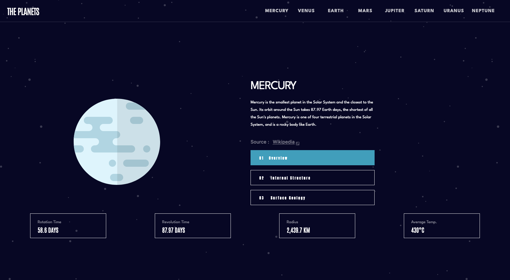
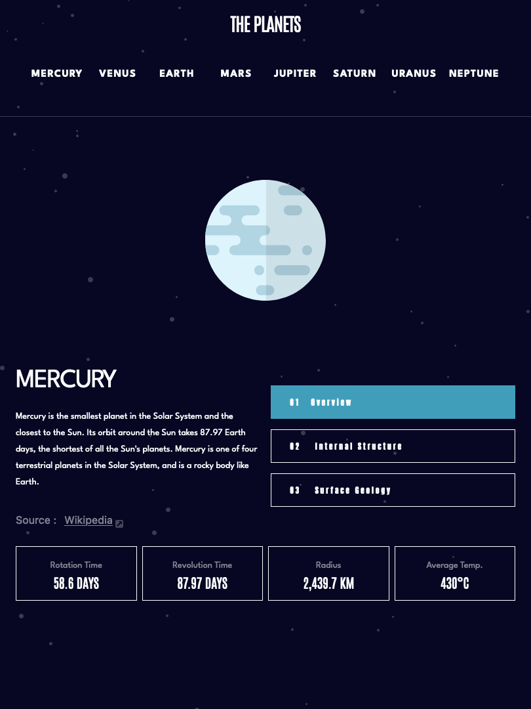
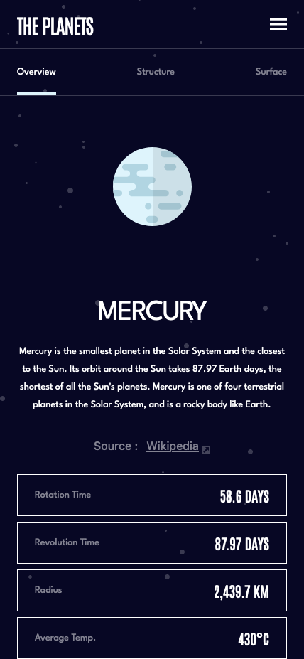

<h1 align="center">Planet Facts Website</h1>

<p>This is a solution to the <a href="https://www.frontendmentor.io/challenges/planets-fact-site-gazqN8w_f">Planets fact site challenge on Frontend Mentor</a>. Frontend Mentor challenges help you improve your coding skills by building realistic projects.</p>

<h1 align="center">Design</h2>

<h2>Desktop:</h2>



<h2>Tablet:</h2>



<h2>Mobile:</h2>



---

<h2>First Of Here's My Files Organization</h2>

- Planet Facts
  - app
    - public
      - index.html
    - src
      - js
        -app.js
  - Design
  - images

<h2>Tailwindcss:</h2>

---

<p>Start Of By Initializing Npm By Typing:</p>

```bash
npm init -y
```

Then You Will See A New File Generated Called **Pachage.json**, And Here Is What's In That File

```{
  "name": "Project Name",
  "version": "1.0.0",
  "description": "",
  "main": "index.js",
  "scripts": {
    "test": "echo \"Error: no test specified\" && exit 1"
  },
  "repository": {
    "type": "git",
    "url": "You Repository Link"
  },
  "keywords": [],
  "author": "",
  "license": "ISC",
  "bugs": {
    "url": "You Repository Issues Link"
  },
  "homepage": "You Repository Link",
}
```

Then Type In The Terminal:

```bash
npm install tailwindcss
```

This Will Be Added To **package.json** File

```
"dependencies": {
    "tailwindcss": "^3.2.7"
}
```

After That Type:

```bash
npx tailwindcss -i ./app/src/input.css -o ./dist/output.css --watch
```

You Will See Two New Files Generated: **./src/input.css**,**/dist/output.css**
. This Is The Last Step, Now You Can Write Classes Like: **bg-red-700, text-9xl** In The Class Attribute Of Any HTML Element

After That The Files Tree Will Be Like This:

- Planet Facts
- app
  - public
    - index.html
  - src
    - js
      -app.
    - input.css
- Design
- dist
  - output.css
- images

---

## What I Have Used:

- Semantic HTML5 Markup
- Flexbox
- CSS Grid
- TailwindCSS - For Styles
- OOP In JS - For Organization

---

<h2>What I Learned From This Project:</h2>

<p>In This Project I Used OOP, Which Realy Makes My Project a Lot Orginized, Also This Is The First Time I Use Tailwindcss, It Is a Great If You Don't Care About The Style Too Much, a Quick Note I Used a Litle Bit Of CSS To Make The Site More Responsive</p>

---

## You Can Find Me In <a href="https://www.frontendmentor.io/profile/akrambzgh">Front End Mentor<a>
